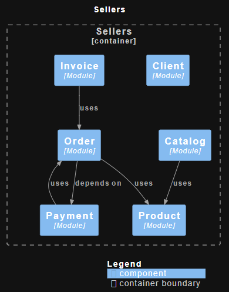

# Spring Modulith

O Spring Modulith é um projeto da equipe do Spring que facilita a criação de aplicações Java modulares dentro do ecossistema do Spring Boot, promovendo uma melhor organização do código, isolamento de responsabilidades e evolução independente dos módulos de uma aplicação monolítica.

### 📦 Conceito por trás do Spring Modulith

**Spring Modulith** permite que você desenvolva **monólitos modulares**, ou seja, aplicações monolíticas bem estruturadas em módulos internos coesos e fracamente acoplados, com suporte para:

-   Organização clara dos **bounded contexts**.
-   Comunicação entre módulos via **eventos**.
-   Ferramentas para **documentar**, **testar** e até **monitorar** os módulos.

### 🧩 Principais Recursos do Spring Modulith

1.  **Declaração de módulos**

    -   Os módulos são organizados por pacotes Java.
    -   É possível anotar classes com `@ApplicationModule` para declarar explicitamente um módulo.

2.  **Verificação de dependências entre módulos**

    -   O Spring Modulith pode **verificar automaticamente** se os módulos estão respeitando as fronteiras definidas.
    -   Detecta acessos indevidos entre módulos.

3.  **Documentação automatizada**

    -   Geração de diagramas de dependência dos módulos (UML/PlantUML).
    -   Exportação de uma visão de arquitetura da aplicação.

4.  **Testes por módulo**

    -   Suporte para testes isolados por módulo com anotações como `@ApplicationModuleTest`.

5.  **Publicação e escuta de eventos**

    -   Comunicação assíncrona entre módulos usando `ApplicationEventPublisher`.
    -   Suporte a eventos síncronos e assíncronos.

6.  **Simulação de modularidade forte**

    -   Embora o Java ainda não tenha mecanismos fortes de encapsulamento de pacotes (fora do Java Platform Module System), o Spring Modulith aplica boas práticas e regras para modularidade dentro das limitações da JVM.

7.  **Integração com Spring Boot**

    -   Usado de forma complementar com aplicações Spring Boot (versão 3.0+), sem alterar a experiência padrão de desenvolvimento.

Ele não força microserviços, mas prepara sua aplicação para eventualmente migrar para uma arquitetura distribuída se for necessário.

# Padrões Utilizados

## 🧩 1. Application Use Case — Padrão Comportamental (DDD / Clean Architecture)

### 🔹 O que é:

É uma abstração da lógica de aplicação que expressa ações do negócio (ex: CreateProduct, RegisterClient, AddProductToCatalog). Representa o que o sistema faz — não como ele faz.

### 🔹Características:

- São classes que orquestram regras de negócio e serviços de domínio.
- São independentes de frameworks.
- Não conhecem HTTP, banco de dados ou APIs externas diretamente.

### 🔹 Finalidade:
Isolar a lógica da aplicação de qualquer detalhe técnico. Essa é a camada entre o controller e o domínio.

### 🔹 Tipo de padrão:
✅ Padrão comportamental/arquitetural (Clean Architecture, DDD, Hexagonal).

## 🧱 2. Monólito Modular — Estilo de Organização (Arquitetura Modular)

### 🔹 O que é:
É uma forma de estruturar um projeto monolítico com módulos isolados por domínio, onde cada módulo tem suas entidades, serviços, use cases, controllers, etc.

### 🔹 Características:
- Cada módulo funciona de forma independente e coesa.
- Evita spaghetti code e acoplamento entre features.
- Facilita a futura migração para microsserviços (mas sem o custo inicial).
- Ajuda a escalar times (cada equipe foca em 1 módulo).

### 🔹 Finalidade:
Organização de um monólito com foco em manutenção, coesão e escalabilidade futura.

### 🔹 Tipo de padrão:
✅ Padrão arquitetural de estrutura (modularização por contexto / bounded context).

### 📌 **Comparando os dois:**

| Aspecto              | Application Use Case                     | Monólito Modular                                 |
|----------------------|------------------------------------------|--------------------------------------------------|
| Tipo de padrão       | Comportamental / Arquitetural (DDD, Clean) | Arquitetural / Estrutural                        |
| Foco                 | Organização da lógica de aplicação       | Organização física do projeto                    |
| Envolve estrutura de código | Sim (camada de application ou use case) | Sim (módulos ou subprojetos)                    |
| Acoplado a tecnologia?| Não (puro domínio)                      | Parcial (usa estrutura de projeto e build)       |
| Complementaridade    | Pode ser usado dentro de um módulo       | Usa use cases como parte de cada módulo          |

# 🧩 Projeto Base com Spring Modulith, WebFlux, R2DBC e Docker

Este projeto tem como objetivo demonstrar uma arquitetura modular utilizando **Spring Modulith**, com suporte a **WebFlux**, **R2DBC**, **PostgreSQL via Docker Compose**, **Flyway** para versionamento do banco e exposição de **endpoints organizados em pacotes `api`**.

## 🚀 Tecnologias e Ferramentas Utilizadas

-   [Spring Modulith](https://docs.spring.io/spring-modulith/)

-   Spring Boot 3.x
-   Spring WebFlux
-   Spring Data R2DBC
-   PostgreSQL (via Docker Compose)
-   Flyway (para versionamento de schema e dados)
-   Docker / Docker Compose
-   Java 17+

## 🧱 Estrutura Modular

O projeto segue o princípio de **monólito modular** com módulos organizados por **bounded contexts** e separados em pacotes distintos. A anotação `@NamedInterface` é utilizada para definir explicitamente os pontos públicos de interação entre módulos.

### 📦 Módulos Esperados

-   `client`
-   `product`
-   `catalog`
-   `order`
-   `payment`
-   `invoice`


Cada módulo terá:

-   Suas próprias entidades e agregados
-   Casos de uso (use cases) isolados
-   Eventos de domínio
-   Endpoints agrupados em pacotes `api` para exposição pública

## Diagrama dos Módulos



## 🧱 Entidades e Agregados Principais

```text
Client       → id, name, email, phone, address  
Product      → id, name, description, price, stockQuantity, category  
Catalog      → id, name, List<Product>  
Order        → id, clientId, List<OrderItem>, totalAmount, status, createdAt, payment  
OrderItem    → productId, productName (snapshot), quantity, unitPrice, totalPrice  
Payment      → id, orderId, status, method, amount, paidAt  
Invoice      → id, orderId, invoiceNumber, generatedAt, totalAmount  

```

## 🧠 Casos de Uso (Use Cases)

Os **Use Cases** representam as operações e regras de negócio que cada módulo oferecerá como interface pública, anotados com `@NamedInterface` nos métodos:

### 📍 ClientUseCases

-   `registerClient(name: String, email: String, phone: String, address: Address)`
-   `updateClientInfo(clientId: Long, name: String?, email: String?, phone: String?, address: Address?)`


### 📍 ProductUseCases

-   `createProduct(name: String, description: String, price: Money, stockQuantity: Int, category: String)`
-   `updateProduct(productId: Long, name: String?, description: String?, price: Money?, stockQuantity: Int?, category: String?)`
-   `listProductsByCategory(category: String): Flux<Product>`
-   `changeStock(productId: Long, quantity: Int)`


### 📍 CatalogUseCases

-   `createCatalog(name: String)`
-   `addProductToCatalog(catalogId: Long, productId: Long)`
-   `removeProductFromCatalog(catalogId: Long, productId: Long)`


### 📍 OrderUseCases

-   `createOrder(clientId: Long, items: List<Pair<Long, Int>>): Mono<Order>`
-   `cancelOrder(orderId: Long)`
-   `markOrderAsPaid(orderId: Long)`
-   `shipOrder(orderId: Long)`


### 📍 PaymentUseCases

-   `processPayment(orderId: Long, method: PaymentMethod): Mono<Payment>`

-   `confirmPayment(paymentId: Long)`


### 📍 InvoiceUseCases

-   `generateInvoice(orderId: Long): Mono<Invoice>`


## ✅ Eventos de Domínio

Os **Eventos de Domínio** são publicados para comunicação assíncrona entre módulos após operações de negócio:

-   `OrderCreated(val orderId: Long)`
-   `PaymentConfirmed(val paymentId: Long)`
-   `OrderShipped(val orderId: Long)`
-   `StockReduced(val productId: Long, val quantity: Int)`
-   `InvoiceGenerated(val invoiceId: Long)`

## 🐳 Ambiente com Docker

### Docker Compose (`docker-compose.yml`)

-   Serviço **PostgreSQL** com volume persistente e credenciais configuráveis via variáveis de ambiente
-   Rede configurada para comunicação entre banco e aplicação

### Dockerfile

-   Baseado em **Eclipse Temurin 17**
-   Copia artefato JAR e configura ponto de entrada na execução da aplicação
-   Exemplo de construção multi-stage com Maven

### ✍️ Exemplo de conteúdo correto do pg_hba.conf (corrigir linha inválida):
O container do PostgreSQL precisa editar o arquivo pg_hba.conf. Substitua qualquer 
linha que esteja parecida com 0.0.0.0/0 sem método de autenticação válido, e use:

host    all             all             0.0.0.0/0               md5
host    all             all             ::/0                    md5

## 🎯 Organização dos Endpoints

Todos os **endpoints** estão localizados no pacote `com.app.example.[context].api.resource`, como também pode ser consultado em: http://localhost:8080/webjars/swagger-ui/index.html

## 🔜 Evolução para Arquitetura de Microserviços

Este projeto foi desenvolvido com base na modularidade e tem como objetivo evoluir para uma arquitetura de microserviços. No futuro, ele será evoluído para um ambiente baseado em arquitetura de microserviços, dentro do repositório [spring-microservice-ecommerce](https://github.com/seu-usuario/spring-microservice-ecommerce). A arquitetura permitirá que os diferentes módulos do sistema sejam escaláveis, independentes e facilmente mantidos, proporcionando uma base sólida para o crescimento da aplicação. A evolução para microserviços será feita utilizando práticas e padrões modernos de desenvolvimento, como:

###

#### Filas de Mensagens e Notificação de Eventos:
- Será adotado o uso de filas de mensagens (ex: RabbitMQ, Apache Kafka, NATS) para comunicação assíncrona entre os microserviços, permitindo alta disponibilidade e resiliência.
- Para notificação de eventos, sistemas de publicação e assinatura (pub/sub) serão usados para garantir a troca eficiente de mensagens entre os serviços.

#### Descoberta de Serviços:
- Para a descoberta dinâmica de serviços em um ambiente distribuído, serão utilizadas soluções como Consul, Eureka ou Zookeeper, que permitem que os microserviços se localizem automaticamente.

#### Circuit Breaker:
- Implementação de padrões de resiliência, como Resilience4j ou Hystrix, para garantir que, se um microserviço falhar, os outros serviços não sejam impactados. Isso aumentará a estabilidade e robustez do sistema como um todo.

#### Autenticação e Autorização:
- A segurança será implementada com OAuth2 e JWT, permitindo autenticação e autorização seguras para os serviços, garantindo que apenas usuários ou sistemas autenticados possam acessar recursos sensíveis.

#### Cache:
- O uso de soluções de cache, como Redis ou Memcached, será adotado para melhorar o desempenho e a escalabilidade do sistema, armazenando dados temporários e evitando sobrecarga nos sistemas de backend.

#### Observabilidade:
- Ferramentas como Prometheus, Grafana, Zipkin e Jaeger serão integradas para proporcionar monitoramento e rastreamento distribuído, permitindo que a equipe de desenvolvimento visualize o comportamento e o desempenho do sistema em tempo real, identificando rapidamente quaisquer gargalos ou falhas.

A evolução para microserviços permitirá que a aplicação se torne mais flexível e escalável, além de facilitar a adoção de novas tecnologias e práticas no futuro. Esse modelo promove a modularidade, a independência dos serviços e a resiliência, características essenciais para sistemas modernos e distribuídos. O projeto é ideal para explorar as vantagens da modularidade com Spring WebFlux, com potencial para crescer conforme a demanda e os requisitos evoluem.
